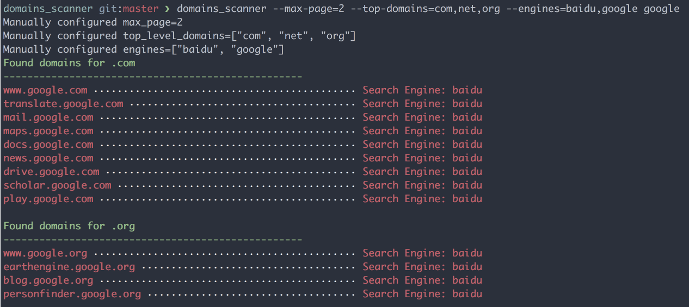

# DomainsScanner

Search possible sub domains according to specified domain. DomainsScanner default use `site:*.{domain}.{top_level_domain}` search syntax to search sites available from baidu and google searchs.



## Installation

Add this line to your application's Gemfile:

```ruby
gem 'domains_scanner'
```

And then execute:

    $ bundle

Or install it yourself as:

    $ gem install domains_scanner

## Usage

```sh
$ domains_scanner -h
Usage: domains_scanner [options] domain_name

Specific options:
    -v, --[no-]verbose               Run verbosely, default: false
        --top-domains=               search top level domains, split by comma, default: ["com", "cn", "com.cn", "net", "org", "ltd", "cc", "mobi", "live", "io", "co", "me", "hk"]
    -e, --engines=                   search engines, split by comma, default: [google, baidu]
        --max-page=                  Maximum number of pages to scan, default: 20

Common options:
    -h, --help                       Show this message
        --version                    Show version
```

## Development

To install this gem onto your local machine, run `bundle exec rake install`. To release a new version, update the version number in `version.rb`, and then run `bundle exec rake release`, which will create a git tag for the version, push git commits and tags, and push the `.gem` file to [rubygems.org](https://rubygems.org).

## Contributing

Bug reports and pull requests are welcome on GitHub at https://github.com/HackerPie/domains_scanner.


## License

The gem is available as open source under the terms of the [MIT License](http://opensource.org/licenses/MIT).

